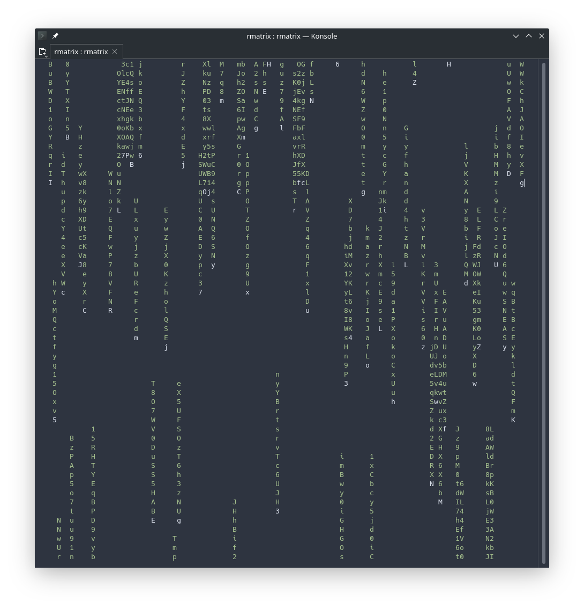

# RMatrix
Terminal program which shows random letters flowing down it, just like in the screens in the matrix.  This is a very simple implementation which just displays letter a-z, A-Z in green.

Press 'q' to exit.

For similar projects, see [cmatrix](https://github.com/abishekvashok/cmatrix) and [unimatrix](https://github.com/will8211/unimatrix).

##### Technologies:
Rust, Termion, tui-rs

#### Screenshot:

